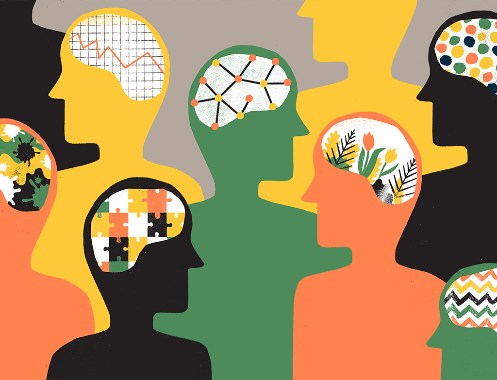

# Five Personality Traits (OCEAN) Prediction using Machine Learning

This is a Machine Learning project aimed at predicting a person's personality traits based on the Five Personality Traits, also known as OCEAN (Openness to experience, Conscientiousness, Extroversion, Agreeableness, Neuroticism).

## Five Personalite Traits

The Five Big personality traits are a proposed taxonomy for describing human personality. They include openness to experience, conscientiousness, extroversion, agreeableness, and neuroticism. These traits represent different aspects of personality and are identified based on semantic associations found in common language. People can exhibit different degrees of each trait, and they are placed on a continuum. In summary, the Five Big personality traits are a way to categorize and describe fundamental aspects of human personality. 
*Source* [Wikipedia](https://en.wikipedia.org/wiki/Big_Five_personality_traits)
## Dataset
The dataset used to develop this Machine Learning project contains 1,015,342 questionnaire responses collected online by Open Psychometrics. [Open Psychometry](https://openpsychometrics.org/tests/IPIP-BFFM/).

## Description
The model developed in this project uses machine learning techniques to predict personality traits based on a set of user-provided features. The personality traits are defined as follows:

1. **Openness to experience**:Indicates whether a person is more inclined to be open, curious, and willing to try new things or if they are more consistent and cautious in their actions.
2. **Conscientiousness**:  Reflects whether a person is more efficient, organized, and goal-oriented or if they are more relaxed and careless in their activities.
3. **Extroversion**: Evaluates whether a person is more outgoing, energetic, and sociable or if they are more reserved and introverted.
4. **Agreeableness**: Evaluates whether a person is more outgoing, energetic, and sociable or if they are more reserved and introverted.
5. **Neuroticism**: Indicates whether a person is more sensitive, nervous, and prone to anxiety or if they are more secure and confident in their emotions and reactions.

## Features
The project utilizes the Gradio library to create an interactive interface for personality trait prediction testing. Through this interface, the user can provide the values for each of the characteristics (Openness, Conscientiousness, Extroversion, Agreeableness, and Neuroticism) and obtain predictions for the corresponding personality traits.

## Conclusion
This Machine Learning project provides a user-friendly interface for predicting a person's personality traits based on the Five Personality Traits (OCEAN). By using the Gradio library, users can easily provide the characteristics and receive immediate predictions. We hope that this project proves useful for understanding and applying personality trait prediction concepts and can be customized and enhanced to meet the specific needs of different users.
